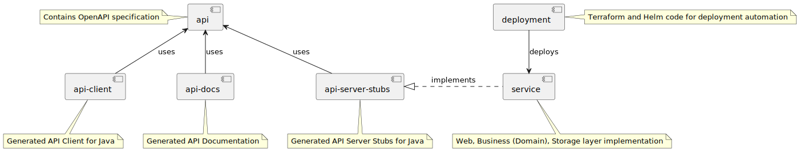

# Introduction

This repository contains a demo code sample intended to use the following concepts and technologies:

* API-first Development Approach
* Open API / Swagger
* Hexagonal (Ports & Adapters) Architecture
* Infrastructure as code (IaC)
* Docker
* Google Cloud Platform (GCP)
* Google Kubernetes Engine (GKE)
* Cloud Build
* Cloud Deploy
* Terraform
* Helm
* Skaffold

# Modules structure



# API

API for the service is described under [api.yaml](api%2Fsrc%2Fmain%2Fresources%2Fapi.yaml).

# Hexagonal (Ports & Adapters) Architecture

This project uses Hexagonal architecture, also known as Ports and Adapters architecture. Hexagonal architecture is a
design pattern that emphasizes decoupling
the core business logic of an application from its external dependencies. In this architecture, the core logic is
surrounded by ports, that handle communication with external systems such as databases, user
interfaces, or third-party services. The purpose of Hexagonal Architecture is to improve maintainability and testability
by promoting separation of concerns and reducing the impact of changes in external dependencies on the core application
logic.


<sub>Image Source: Hexagonal Architecture Explained - https://www.arhohuttunen.com/hexagonal-architecture/</sub>
<p/>

By separating concerns and dependencies, Hexagonal Architecture enables meaningful business use case testing through the
implementation of "ports" or interfaces. The ports define the contract between the core application logic and its
external dependencies, allowing for easy substitution of implementations during testing. For example, in unit tests,
mock implementations of these ports can be used to simulate interactions with external systems, enabling meaningful
testing of business logic in isolation.


<sub>Image Source: Hexagonal Architecture Explained - https://www.arhohuttunen.com/hexagonal-architecture/</sub>
<p/>

For more information on Hexagonal (Ports & Adapters) Architecture please see [Hexagonal Architecture Explained
](https://www.arhohuttunen.com/hexagonal-architecture/).

# Testing approach

This project uses the Detroit School of Testing to achieve meaningful tests for Domain Services exposed using Ports.
This is made possible by adopting Hexagonal Architecture and separating Business concerns from Technical concerns.

Mocking (using for example Mockito) is limited to achieve meaningful testing. Fakes are
used, for
example ([InMemoryTodoItemsRepository.java](service%2Fsrc%2Ftest%2Fjava%2Fcom%2Fdominikcebula%2Ftodo%2Fservice%2Fadapter%2Fout%2Fdb%2FInMemoryTodoItemsRepository.java)),
to test behaviors in isolation.

API testing is implemented that covers end-to-end flows, including real DB to assure fakes behaviors do not drift from
actual behaviors.

Testing pyramid is preserved by limiting amount of end-to-end tests, and most tests are implemented in isolation as
Domain Services tests.

More on this subject can be found under:

[Unit Testing - Principles, Practices, and Patterns by Vladimir Khorikov](https://khorikov.org/files/infographic.pdf)

[Pragmatic Unit Testing by Vladimir Khorikov](https://assets.ctfassets.net/9n3x4rtjlya6/2TGdlhqDhmqKwaOE6QmwGQ/d173c9d91cdc84534a6880f8c8201029/Vladimir_Khorikov_Pragmatic_unit_testing.pdf)

# API-first Development Approach

API-first development approach is a methodology that prioritizes designing and building the application programming
interface (API) before implementing other aspects of the software system. This strategy ensures that the API is
well-defined, robust, and supports intended use cases. Open API, formerly known as
Swagger, plays a crucial role in API-first development by providing a standardized format for documenting APIs. With
Open API, developers can describe the functionality, data models, and endpoints of their APIs in a standardized
format, allowing integration and collaboration across teams. API-first approach leverages tools like Open
API and Swagger.

# CI/CD Pipeline

Project uses Cloud Build and Cloud Deploy for C/CD Pipeline. Final artifact as Docker Image is stored in Artifact
Registry and deployed to GKE.

CI pipeline is described in [cloudbuild.yaml](cloudbuild.yaml) file.
Cloud Build is created using Terraform under [cloud_build.tf](deployment%2Finfrastructure%2Fcloud_build.tf).
Docker Images are kept in Artifact Registry created
under [docker_repository.tf](deployment%2Finfrastructure%2Fdocker_repository.tf).

CD pipeline is described
in [cloud_deploy.tf](deployment%2Finfrastructure%2Fcloud_deploy.tf) and [skaffold.yaml](skaffold.yaml).
Kubernetes objects are rendered using Helm and Helm Chart is available under [workload](deployment%2Fworkload) folder.

# Build

Project is build using Maven:

```shell
mvn clean install
```

Docker Image can be created using following commands from `service` folder level:

```shell
docker buildx build -t todo-service .
```

Once gcloud cli is configured, you can also trigger build in cloud using below command:

```shell
gcloud builds submit
```

When running build in cloud, Docker Image will be stored in Artifact Registry.

# Run locally

## Using Java

```shell
java -jar target/todo-service-*.jar
```

## Using Docker

Since service accesses Firestore in GCP Cloud you need to make sure that when executed as Docker Container, application
has access to [Application Default Credentials](https://cloud.google.com/docs/authentication/provide-credentials-adc).

[Application Default Credentials](https://cloud.google.com/docs/authentication/provide-credentials-adc) will be stored
under `~/.config/gcloud/application_default_credentials.json`. Docker can access it using Docker volume.

Below are the commands that will setup Docker volume and credentials on volume:

```shell
docker volume create gcp_credentials
sudo mkdir /var/lib/docker/volumes/gcp_credentials/_data/gcloud
sudo cp ~/.config/gcloud/application_default_credentials.json /var/lib/docker/volumes/gcp_credentials/_data/gcloud
sudo chmod -R 0700 /var/lib/docker/volumes/gcp_credentials/_data/gcloud
sudo chown -R 1001:1001 /var/lib/docker/volumes/gcp_credentials/_data/gcloud
```

Having volume and credentials setup done, you can run container
with [Application Default Credentials](https://cloud.google.com/docs/authentication/provide-credentials-adc) available
for the application inside the container.

```shell
docker run --rm -e GOOGLE_APPLICATION_CREDENTIALS=/opt/app/.config/gcloud/application_default_credentials.json -e SPRING_PROFILES_ACTIVE=env-snd -v gcp_credentials:/opt/app/.config -p 8080:8080 todo-service
```

# Deployment

TBD

# Ideas

* Introduce Performance Tests with JMeter
* Introduce Port for Events and Pub/Sub
* Automatic and manual builds triggers in cloud build

# References

Hexagonal Architecture Explained. Accessed April 24, 2024. https://www.arhohuttunen.com/hexagonal-architecture/

# Author

Dominik Cebula

* https://dominikcebula.com/
* https://blog.dominikcebula.com/
* https://www.udemy.com/user/dominik-cebula/
